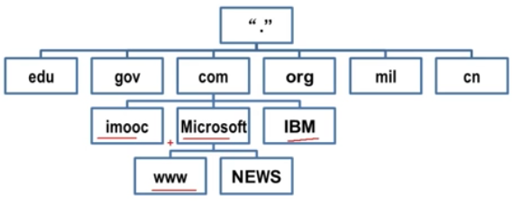
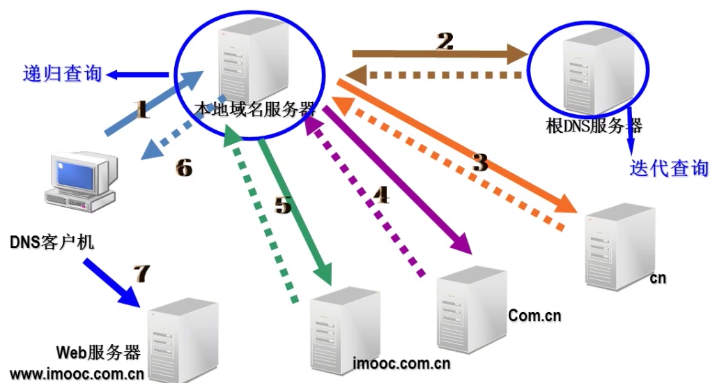

不配置DNS是不能访问互联网的

Domain Name System的缩写，域名系统的缩写，又叫名称解析

名称解析概述
* 在互联网中，通过IP地址来进行通信
* IP地址用数字表示，记忆起来比较困难
* 人对域名更加敏感

在DNS出现之前，我们有hosts文件（静态IP和域名对应），优先级比DNS更高

从Hosts文件到DNS
* 早期Hosts文件解析域名
    1. 名称解析效能下降
    2. 主机维护困难
* DNS服务
    1. 层次性
    2. 分布式

DNS服务的作用
* 将域名解析为IP地址
    1. 客户机向DNS服务器发送域名查询请求
    2. DNS服务器告知客户机Web服务器的IP地址
    3. 客户机与Web服务器通信

域名空间结构

​          

* 根域
* 顶级域（域名分配组织ISO分配）
    1. 组织域（gov政府，com商业，edu教育，org民间组织，net网络服务，mil军事）
    2. 国家或地区域(cn中国，hk香港，jp日本，uk英国，au澳大利亚)
* 二级域
* 主机名

DNS查询过程
         

DNS查询类型
* 从查询方式上区分
    * 递归查询：要么做出查询成功响应，要么作出查询失败的响应，一般客户机和服务器之间属于递归查询，即当客户机向DNS服务器发出请求后，若DNS服务器本身不能解析，则会向另外的DNS服务器发出查询请求，得到结果后转交给客户机
    * 迭代查询：服务器收到一次迭代查询回复一次结果，这个结果不一定是目标IP与域名的映射关系，也可以是其他DNS服务器的地址
* 从查询内容上区分
    * 正向查询由域名查找IP地址
    * 反向查询由IP地址查找域名
