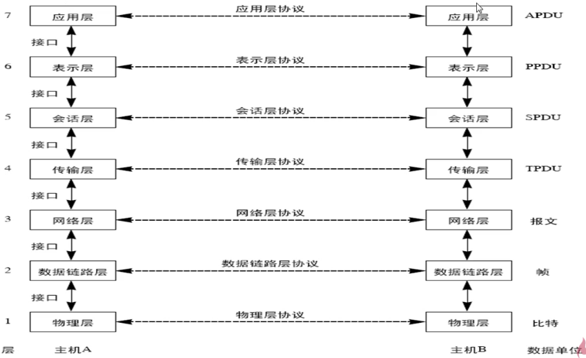
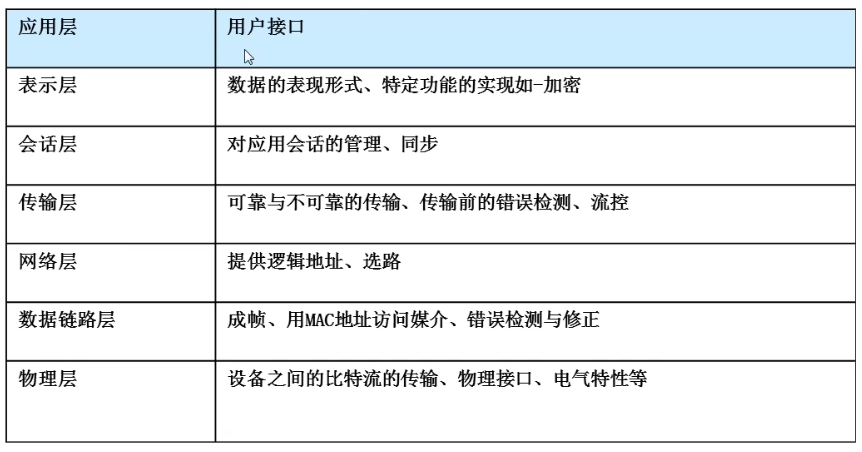

- iso：国际标准化组织
- osi：开放系统互联模型

是TCP/IP四层模型的基础

从低到高依次：

​	物理层 数据链路层 网络层 传输层（下四层实际传输） 会话层 表示层 应用层（上三层给用户服务） 

​	物理层：传输单位比特，真正的数据传输

​	数据链路层：传输单位帧，这里边包含MAC地址（物理地址，计算机网卡的硬件地址）

​	网络层：报文，这里边包含IP地址（逻辑地址）

​	传输层：数据段 TPDU（传输协议传输协议）

​	会话层：SPDU(会话协议传输地址)

​	表示层：PPDU（表示协议传输地址）

​	应用层：APDU（应用协议传输地址）

七层模型：

