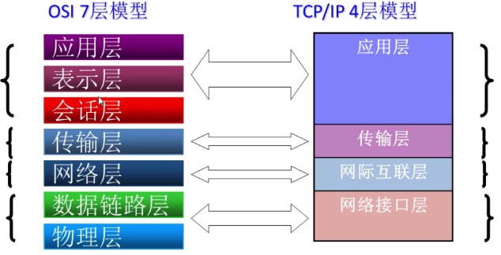
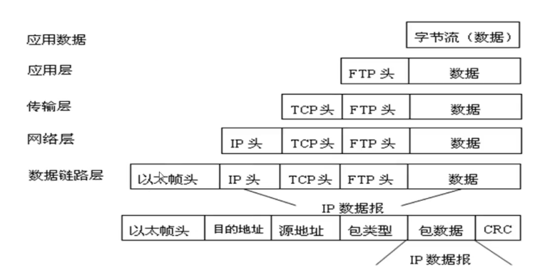

TCP/IP模型与OSI参考模型的对应关系：

数据封装的过程：

tcp/ip模型与osi模型的比较：

- 共同点：
- 1. osi参考模型和tcp/ip参考模型都采用了层次结构的概念
  2. 都能提供面向连接和无连接两种通信服务机制
- 不同点：
- 1. 前者是七层模型，后者是四层结构
  2. 对可靠性要求不同（后者更高）
  3. osi模型是在协议开发前设计的，具有通用性，tcp/ip是先有协议然后建立模型，不适用于非tcp/ip网络
  4. 实际市场应用不同（osi是理论上的模型，并没有成熟的产品，而tcp/ip已经成为“实际上的国际标准”）