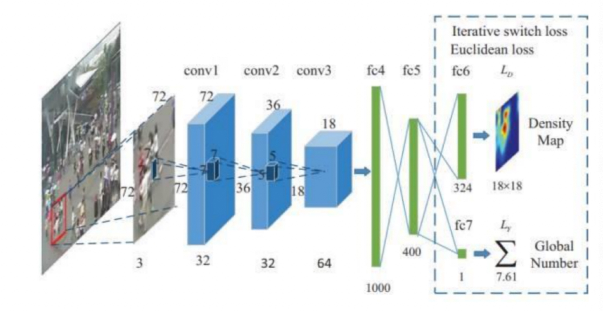
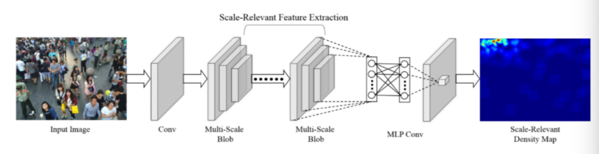
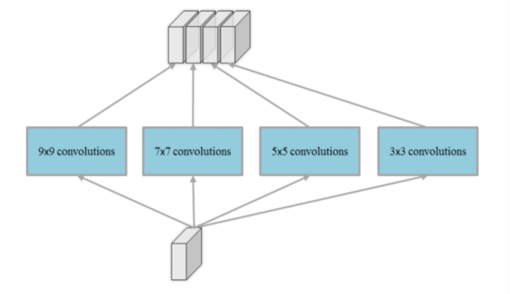

#### 核心实验

1. 手动提取特征回归人数 

   a) 解决人群计数问题的传统的做法是手动设计并提取各种特征(Hand-craftedFeatures)，然后再基于这些特征训练一个线性或非线性函数来回归人头数。此类 算法大多三个步骤: 1)前景分割;2)特征提取;3)人数回归。接下来将对这三个步骤分别做介绍。 

   ​	i. 前景分割 前景(人群)分割的目的是将人群从图像中分割出来便于后面的特征提取， 分割性能的好坏直接关系的最终的计数精度，因此这是限制传统算法性能的一个 重要因素。常用的分割算法有:光流法(Optical Flow)、混合动态纹理(Mixture of Dynamic Textures)、小波分析(Wavelets) 等。 

   ​	ii. 特征提取 在完成前景分割之后，紧接着就是从分割得到的前景(人群)提取各种不同 的低层特征(Low-level Features)，常用的特征有:人群面积和周长(Area and Perimeter of Crowd Mask)、边的数量(Edge Count)、边的方向(Edge Orientation)、 纹理特征(Texture Features)、闵可夫斯基维度(Minkowski Dimension)等。 

   ​	iii. 人数回归 该步骤的目的是将上一步提取到的特征回归到图像中的人数，回归可以是简 单的线性回归，也可以用复杂的非线性回归。常用的回归方法有:线性回归(Linear Regression)、分段线性回归(Piece-wise Linear Regression)、脊回归(Ridge Regression)、高斯过程回归(Gaussian Process Regression)等。 

   b) 而对于单张图像而言没有运动信息，那么人群分割就显得非常困难，因此此 类算法一般直接从整张图像或者其子区域提取特征，然后再计算图像中人群数量。 通过查询网上资料，最终确定为利用 python 以及 python-opencv 简单地实现 算法，达到人脸检测、人头检测等基本目的。 

2. 深度卷积神经网络 

   基于深度学习的人群分析技术，不再采用人为定义特征的方式去判断目标是 否为“人”。通过使用大量数据训练模型，计算机可以自行学习并抽象出人群的 概念，并有效提取出针对人群分析有效的特征。这种针对人群整体的分析方法有 效克服了传统的基于人的个体分析方法所无法解决的大规模复杂场景的适应性 问题，并且人数统计精确度达到 95%以上。下图为针对人群密度估计的卷积神经 网络结构图: 

   

   目前人群密度估计的深度卷积神经网络有多种，包括 single-CNN、 multi-column CNN、multi-network CNN、multi-scale CNN、adapting CNN 等。 single-CNN 采用单列神经网络估计人群密度图，但是受限于获取图片多尺度信息 而难以达到更好地效果;multi-column CNN 采用多列卷积神经网络，每列网络使 用不同尺寸的卷积核，更充分地获取图片尺度信息并且达到良好效果，此外 multi-network CNN 采用深浅两列网络以解决空间分辨率问题，但是 Multi-column/network 有两个缺点:一点是需要预训练单列网络以达到全局优化， 为端到端训练增加复杂度，另一点是引入更多的参数，消耗更大的计算资源。而 multi-scale CNN 采用单列网络+多尺度卷积核的方式，下图为 MSCNN 的神经网 络结构图: 

   

   其中每层网络分为 9*9、7*7、5*5、3*3 四种尺度卷积核，如下图所示: 

   

   MSCNN 既克服图片尺度变化问题，又克服多元网络的参数过多、全局优化困难 等问题，故在本项目最终采用 MSCNN 作为本项目的核心算法。而 ACNN 充分 利用摄像头角度信息训练网络，但是由于精力有限没有进一步实践 ACNN 算法。

#### 实际操作

​	语言使用python，并导入open-cv模块对图像进行处理以及MCNN和numpy等核心模块，数据集为从网络下载，并使用matlab为测试数据创建地面实况文件和创建训练和validataion集以及地面实况文件

​	github: https://github.com/DemoMath/Density-detection