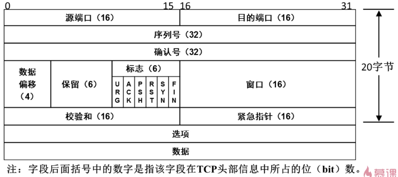
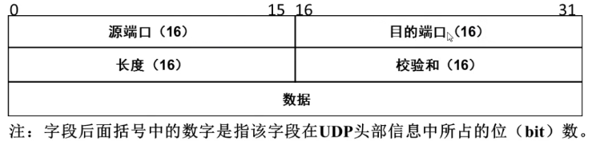

在传输层确定端口号

通过ip能确定对方服务器位置，服务器上开启了一些服务，不同服务有不同的端口号，端口号就是为了确定目标服务器相应的服务

端口号 2的16次方  0 - 65535

**TCP协议包头：**

**UDP协议包头：**

**常见端口号：**

- FTP（文件传输协议）端口号：20 21 
- SSH（安全shell协议）：端口号 22 
- telnet（远程登录协议）：端口号 23（禁用，明文传输） 
- DNS（域名系统）：端口号53 
- http（超文本传输协议）：端口号80 
- SMTP（简单邮件传输协议）：端口号25 
- POP3（邮局协议3代）：端口号 110 

查看本机启用的端口命令：

netstat -an 

​     -a：查看所有连接和监听端口 

​     -n：显示IP地址和端口号，而不显示域名和服务名 